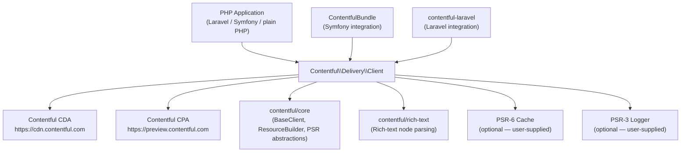
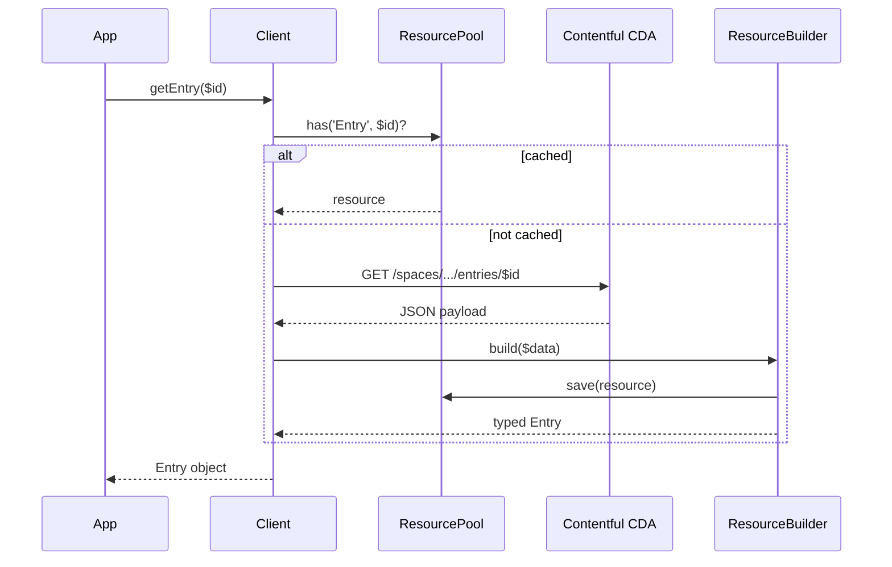

# Architecture

<!-- Generated by seed-golden-context | Last updated: 2026-05-11 -->

## Overview

`contentful.php` is the official PHP client library for the Contentful Content Delivery API (CDA) and Content Preview API (CPA). It is a publish-and-forget open-source library distributed via Packagist, scoped to a single space and environment per `Client` instance. It turns raw CDA JSON responses into typed PHP objects and provides caching, link resolution, rich-text parsing, and sync support.

## System Context

## Internal Structure

| Directory / File | Purpose |
|---|---|
| `src/Client.php` | Public entry point. One instance = one space + environment. Inherits HTTP plumbing from `contentful/core`. |
| `src/ClientOptions.php` | Fluent builder for client configuration (host, cache, logger, locale, query cache). |
| `src/ResourceBuilder.php` | Converts raw CDA JSON arrays into typed `Resource` objects. Extends `BaseResourceBuilder` from core. Pre-fetches all content-type definitions needed by a collection response in a single batched query. |
| `src/Mapper/` | One mapper class per resource type (`Asset`, `Entry`, `ContentType`, `Environment`, etc.). Each mapper is responsible for hydrating a single resource from its JSON representation. |
| `src/Resource/` | Typed domain objects: `Entry`, `Asset`, `ContentType`, `Space`, `Environment`, `Locale`, `Tag`, deleted-resource stubs. `LocalizedResource` is the base for locale-aware resources. |
| `src/ResourcePool/` | In-memory identity map. `Standard` pool holds all resolved resources; `Extended` pool adds PSR-6 persistence. Prevents redundant API calls within a request. |
| `src/Cache/` | Cache warm-up (`CacheWarmer`) and clear (`CacheClearer`) utilities. Serialises resolved resources into a user-supplied PSR-6 pool at deploy time. |
| `src/QueryPool/` | Optional PSR-6-backed query-result cache. Caches `getEntries()` responses by query fingerprint for a configurable TTL. |
| `src/Synchronization/` | Wraps the Contentful Sync API. `Manager` drives incremental sync by walking paginated result pages and emitting typed resource events. |
| `src/Console/` | Symfony Console commands for cache warm-up and clear, exposed via `bin/contentful`. |
| `src/LinkResolver.php` | Resolves `Link` objects to their target resources using the resource pool or a live API call. |
| `src/Query.php` | Fluent query builder for CDA query parameters (filters, ordering, select, locale, limit, skip). |
| `src/ScopedJsonDecoder.php` | Thin wrapper that validates space/environment scope in CDA responses before handing off to the resource builder. |
| `src/SystemProperties/` | Typed wrappers for the `sys` metadata block on every CDA resource. |
| `tests/` | PHPUnit test suite, using `php-vcr` cassettes for integration-level tests. Unit tests mirror the `src/` structure. |

## Data Flow

For collection responses (`getEntries()`), `ResourceBuilder` additionally:
1. Batches content-type lookups for all entry types in the response.
2. Resolves `includes.Entry` and `includes.Asset` arrays before returning the top-level collection.

## Key Dependencies

| Dependency | Why it's here |
|---|---|
| `contentful/core` ^4.0 | Shared HTTP client base (`BaseClient`), resource pool interfaces, resource builder base, PSR abstractions. All Contentful PHP SDKs share this foundation — see [ADR-0001](./docs/ADRs/0001-contentful-core-foundation.md). |
| `contentful/rich-text` ^4.0 | Parses CDA Rich Text field values into a typed node tree. Separated into its own package so it can be reused by the management SDK. |
| `psr/cache` ^2.0\|^3.0 | PSR-6 cache interface. SDK accepts any compliant pool; `symfony/cache` ships as the default adapter. |
| `psr/log` ^1.0\|^2.0\|^3.0 | PSR-3 logging. Two log entries per request: a summary at INFO/ERROR and a full request+response dump at DEBUG. |
| `symfony/cache` ^5–7 | Default in-process NullAdapter and concrete cache adapters users can swap. |
| `symfony/console` ^2.7–7 | Powers the `bin/contentful` CLI for cache management. |
| `symfony/filesystem` ^2.7–7 | Used internally for filesystem cache operations. |
| `php-vcr/php-vcr` (dev) | Records/replays HTTP cassettes for integration tests without live API calls. **Flagged as deprecated** — the space used to record existing cassettes no longer exists; migration to a different test harness is needed. See [ADR-0005](./docs/ADRs/0005-php-vcr-integration-testing.md). |
| `phpstan/phpstan` (dev) | Static analysis at level 5. |
| `roave/backward-compatibility-check` (dev) | Automated BC break detection on every PR. |

## Configuration

All configuration flows through `ClientOptions`:

| Option / Method | Purpose | Default |
|---|---|---|
| `withHost(string $host)` | Override the CDA base URL (useful for proxies or EU residency). | `https://cdn.contentful.com` |
| `usingPreviewApi()` | Switch to the Preview API host. | Off (Delivery API) |
| `withDefaultLocale(string $locale)` | Locale code applied to all requests that do not specify one explicitly. | `null` (CDA default locale) |
| `withLogger(LoggerInterface $logger)` | PSR-3 logger for request/response telemetry. | `NullLogger` |
| `withCache(CacheItemPoolInterface, $autoWarmup, $cacheContent)` | PSR-6 pool for space metadata and optionally entry/asset caching. | `NullAdapter` |
| `withHttpClient(GuzzleHttp\Client $client)` | Custom Guzzle instance with middleware (retry, circuit-breaker, etc.). | Default Guzzle client |
| `withoutMessageLogging()` | Disable in-memory request/response log (reduces memory in long-running processes). | Enabled |
| `withQueryCache(CacheItemPoolInterface, int $lifetime)` | PSR-6 pool + TTL for `getEntries()` query-result caching. | `NullAdapter`, 0 s |

Environment-level scope is fixed at `Client` construction time (`$spaceId`, `$environmentId`). Multiple spaces require multiple `Client` instances.

## Integration Points

### Upstream (this repo consumes)

- **Contentful CDA** (`https://cdn.contentful.com`) — primary read-only content API.
- **Contentful CPA** (`https://preview.contentful.com`) — preview (unpublished) content, same API surface.
- **`contentful/core`** — HTTP plumbing, resource builder protocol, PSR shims.
- **`contentful/rich-text`** — rich-text field parsing.

### Downstream (consumes this repo)

- **PHP applications** — any PHP app fetching Contentful content (standalone, Laravel, Symfony, etc.).
- **`contentful/contentful-laravel`** — Laravel service provider wrapping this SDK.
- **`contentful/ContentfulBundle`** — Symfony bundle wrapping this SDK.
